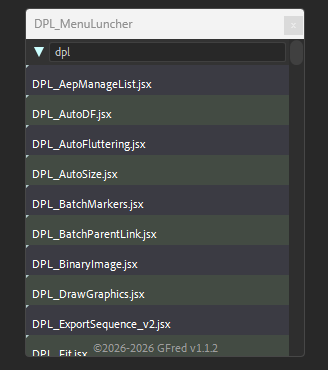
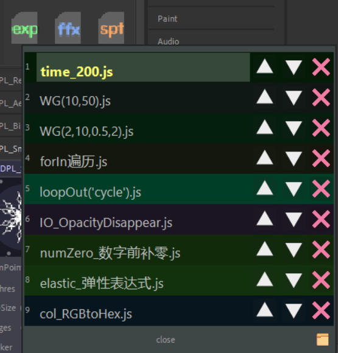
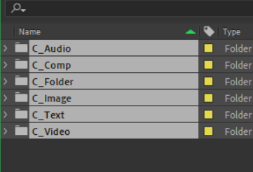
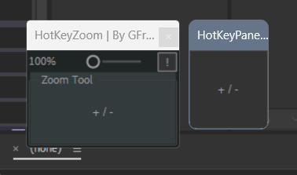

# DPL_scripts_lib

## AE-script-lib

personal ae scripts
一个ae自用脚本仓库
environment: windows10/11
use: AE 20~24

> This is a personal script library for AE. The script code is open source, but the scripts cannot be used for activities that violate laws and regulations or for commercial purposes.

# 📚独立脚本

## :book:DPL_MenuLuncher

## 一个脚本启动器, 识别ScriptUI文件夹中的\*.jsx脚本,点击列表调用菜单命令打开相应脚本

## 

## :book:DPL_MenuLuncher

## 一个星标文件启动器,用于快速启动expression, ffx, script文件.右键设置按钮打开配置文件, 脚本依赖读取路径打开文件

# 📚散装脚本

# :book:DPL_MultPathRender

- 当前AE版本多个输出项目只能手动更改每个输出路径，此脚本用于批量更改渲染队列项目的输出路径。

# :book:DPL_CollectFile

Collect the project window files to the custom Folders.

## 使用：

- 默认创建6个文件夹：

> C_Folder,
> C_Comp,
> C_Audio,
> C_Video,
> C_Image,
> C_Text

- 可放入Kbar/Sp-toolbar内使用 或 直接运行
- 运行先检查是否有这几个文件夹，如果有就进行索引然后放入文件，没有就新建

## 运行逻辑

- 文件收集
    > 由于Project窗口会进行自动排列，如果从顶上删除文件，下方文件会自动往上移动进行对齐，因此不能用图层的逻辑进行循环操作，本脚本采用的是每一项均进行一次遍历，先检查FolderItem的名字和所属，查找是否存在自定文件夹，存在就指定变量名待用，不存在就新建。文件夹检查完依次检查其他项。
- 格式分类
    > 格式是写死在脚本内的，
    > 使用正则表达式索取常用的文件格式，未定义/未写入脚本的格式可能无法分类。\*需要修改可以查找替换，代码不算很多应该容易找到。

## 外部调用

使用Soil-ts项目进行构建和编译。

# :book:DPL_HotKeyZoom

一个简单的AE视图缩放脚本

## 使用说明：

> 滑竿拖动缩放视图，
> 鼠标左键放大右键缩小，
> 点击弹出面板聚焦后可以右键面板设置快捷键，
> 聚焦弹出面板时可以使用键盘热键。
